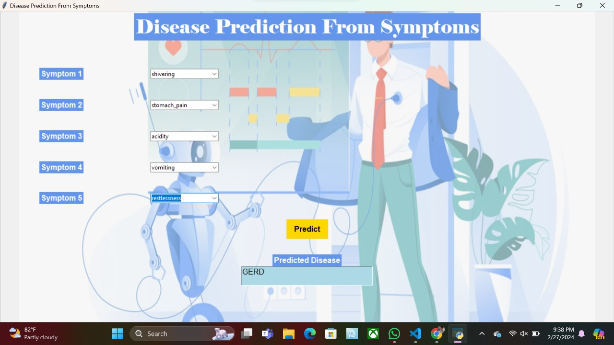

# Disease Prediction System Using Machine Learning

A machine learning-based application that predicts possible diseases from user-provided symptoms using the Naïve Bayes algorithm. The project includes data preprocessing, model training, and a user-friendly graphical interface (GUI) developed with Tkinter.

## Project Overview

This project was developed as part of my final-year B.Tech in Computer Science Engineering. It demonstrates the application of machine learning in healthcare by predicting diseases based on symptoms entered by the user. The system preprocesses symptom data, applies a Naïve Bayes classifier, and displays the predicted disease through an intuitive Tkinter-based graphical user interface.

## Features

- Predicts diseases based on user-entered symptoms.
- Uses the Naïve Bayes machine learning algorithm for classification.
- Performs data preprocessing to improve prediction accuracy.
- Provides a simple and user-friendly graphical interface (GUI) using Tkinter.
- Supports prediction for multiple diseases such as Diabetes, Malaria, Jaundice, Dengue, and Tuberculosis.
- Demonstrates the practical application of machine learning in healthcare.

## Technologies Used

| Category | Technologies |
|----------|--------------|
| Programming Language | Python |
| Machine Learning | Naïve Bayes |
| Libraries | Pandas, NumPy, Scikit-learn |
| GUI | Tkinter |
| Development Environment | Visual Studio Code |
| Version Control | Git & GitHub |

## Dataset

The project uses two datasets:

- **Training.csv** – Used to train the machine learning model.
- **Testing.csv** – Used to evaluate the model's predictions.

Each dataset contains symptom-based features as input variables and the corresponding disease as the target label used for model training and evaluation.

## Project Workflow

```text
User Enters Symptoms
          │
          ▼
Data Preprocessing
(Cleaning & Feature Selection)
          │
          ▼
Naïve Bayes Model
          │
          ▼
Disease Prediction
          │
          ▼
Display Result in Tkinter GUI
```

## How It Works

1. The user enters symptoms through the graphical interface.
2. The system preprocesses the input data.
3. The trained Naïve Bayes model analyzes the symptoms.
4. The model predicts the most likely disease.
5. The predicted result is displayed to the user.
   
## Project Structure

```text
Disease-Prediction-System-Using-Machine-Learning/
│
├── README.md                  # Project documentation
├── demo1.py                   # Main application
├── Training.csv               # Training dataset
├── Testing.csv                # Testing dataset
├── hospital.webp              # GUI image/resource
├── output.jpg                 # Sample output screenshot
├── UML Diagrams.docx          # UML diagrams and system design
```

## Installation

### 1. Clone the repository

```bash
git clone https://github.com/Harshini-8974/Disease-Prediction-System-Using-Machine-Learning.git
```

### 2. Navigate to the project folder

```bash
cd Disease-Prediction-System-Using-Machine-Learning
```

### 3. Install the required libraries

```bash
pip install -r requirements.txt
```

### 4. Run the application

```bash
python demo1.py
```

## Application Screenshot

The image below shows the Disease Prediction System interface.



## Key Learning Outcomes

- Applied machine learning techniques to a real-world healthcare problem.
- Learned data preprocessing and feature handling.
- Built a desktop GUI using Tkinter.
- Worked with structured healthcare datasets.
- Improved problem-solving and Python programming skills.

## Future Improvements

## Future Improvements

- Compare multiple machine learning algorithms for improved accuracy.
- Develop a web application using Flask or Streamlit.
- Integrate real-time healthcare datasets.
- Display confidence scores for predictions.
- Deploy the application on a cloud platform.

## Note

This project was developed as part of my final-year B.Tech Computer Science Engineering curriculum for educational purposes.

## Author

**Harshini Sai Ratna Akula**

- B.Tech in Computer Science Engineering
- Python | SQL | Machine Learning | Data Analysis
- GitHub: [Harshini-8974](https://github.com/Harshini-8974)
